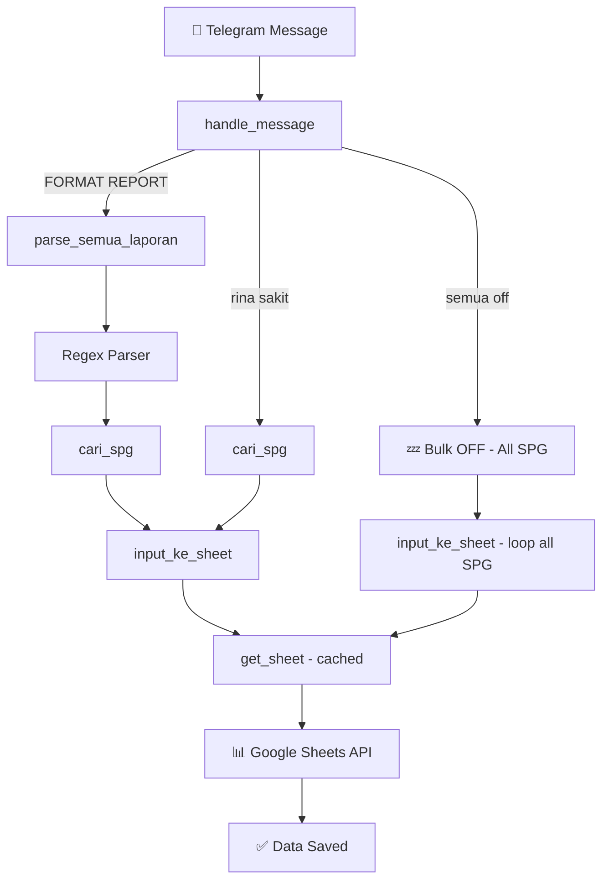

# 📊 SPG Daily Reporting Automation Bot

> A Python-based Telegram bot that **automates daily SPG attendance and KPI reporting**, parsing structured messages and syncing data directly to **Google Sheets** via the Google Sheets API.

---

## 📋 Overview

In a typical field sales operation, SPG (Sales Promotion Girls/Boys) supervisors collect daily reports through Telegram group chats. These reports contain attendance statuses and KPI metrics (Selling, Call, EC) that must be manually entered into spreadsheets — a repetitive and error-prone process.

**This bot eliminates that manual work entirely.**

---

## ✨ Features

| Feature | Description |
|---------|-------------|
| 📥 Auto-Parse Reports | Reads structured reports from Telegram and extracts data automatically |
| 📦 Multi-Report | Supports multiple SPG reports in a single message |
| 🔍 Flexible Parsing | Tolerant of spacing, casing, and minor format variations |
| ✅ Attendance Status | HADIR / SAKIT / IJIN / CUTI / ALFA / OFF |
| 💤 Bulk OFF | Mark all SPG as OFF with a single command |
| 📊 Google Sheets Sync | Data goes directly into the correct sheet and row |
| ⚡ Session Caching | Cached Google Sheets connection for efficiency |
| 🔒 Secure Config | All credentials loaded from environment variables |

---

## 🛠️ Tech Stack

| Layer | Technology |
|-------|------------|
| Language | Python 3.11+ |
| Telegram API | python-telegram-bot 20.x (async) |
| Google Sheets API | gspread + oauth2client |
| Authentication | Google Service Account (OAuth2) |
| Config Management | python-dotenv |
| Text Parsing | Built-in `re` (regex) |

---

## 🏗️ Architecture



---

## 📝 Example Usage

### Daily Report

```text
FORMAT REPORT SPG = RINA
TOTAL SELLING = 25
TOTAL CALL    = 40
TOTAL EC      = 12
```

### Multiple Reports in One Message

```text
FORMAT REPORT SPG = BUDI
TOTAL SELLING = 30
TOTAL CALL = 45
TOTAL EC = 8

FORMAT REPORT SPG = EKO
TOTAL SELLING = 20
TOTAL CALL = 33
TOTAL EC = 5
```

### Attendance Status

```text
rina sakit
budi off
dewi ijin
```

### Bulk OFF

```text
semua off
```

---

## 📊 Google Sheets Mapping

Data is written to columns **G** through **S**:

| Column | Field | Example |
|--------|-------|---------|
| G | Nama SPG | Rina Kartika |
| H | Keterangan | HADIR |
| I | Program | GROSIR |
| J | Wilayah | CIREBON |
| K | Minggu ke- | 3 |
| L | Tanggal | 19 Agustus 2026 |
| M | ID Toko | 7001001/7001002 |
| N | Nama Toko | TOKO MAKMUR (M2) |
| O | Total Selling | 25 |
| P | *(reserved)* | |
| Q | *(reserved)* | |
| R | Total Call | 40 |
| S | Total EC | 12 |

---

## 🚀 Installation

### 1. Clone the repository

```bash
git clone https://github.com/stevendiyanto76-oss/telegram-spg-reporting-bot.git
cd telegram-spg-reporting-bot
```

### 2. Create a virtual environment

```bash
python -m venv venv

# Windows
venv\Scripts\activate

# Linux / Mac
source venv/bin/activate
```

### 3. Install dependencies

```bash
pip install -r requirements.txt
```

### 4. Configure environment variables

```bash
cp .env.example .env
```

Then edit `.env` and fill in all required values.

### 5. Setup Google Service Account

1. Go to [Google Cloud Console](https://console.cloud.google.com/)
2. Create a new project and enable **Google Sheets API** + **Google Drive API**
3. Create a **Service Account** and download the JSON key file
4. Share your Google Spreadsheet with the Service Account email (as Editor)
5. Place the JSON file in the project directory (it is excluded by `.gitignore`)

> See [`config/README.md`](config/README.md) for detailed step-by-step instructions.

### 6. Run the bot

```bash
python bot.py
```

---

## 🔑 Environment Variables

| Variable | Description |
|----------|-------------|
| `TELEGRAM_BOT_TOKEN` | Bot token from [@BotFather](https://t.me/BotFather) |
| `GOOGLE_SERVICE_ACCOUNT_FILE` | Path to the JSON credentials file |
| `GOOGLE_SHEET_ID` | Google Spreadsheet ID (from the URL) |
| `GOOGLE_SHEET_NAME` | Worksheet / tab name inside the spreadsheet |

---

## 🛡️ Security

> **⚠️ The following must NEVER be committed to the repository:**
> - `.env` file (contains real tokens)
> - Google Service Account JSON credentials
> - Real Telegram bot tokens
> - Internal company or customer data

The included `.gitignore` is pre-configured to prevent accidental commits of these files.

---

## 📁 Project Structure

```text
telegram-spg-reporting-bot/
├── bot.py                  # Main application
├── requirements.txt        # Python dependencies
├── .env.example            # Template for environment variables
├── .gitignore              # Git exclusion rules
├── README.md               # This file
├── config/
│   └── README.md           # Google API setup guide
└── docs/
    └── architecture.md     # System architecture diagram
```

---

## 💡 Future Improvements

- [ ] Local SQLite database as a backup before syncing to Sheets
- [ ] Weekly summary dashboard via `/summary` command
- [ ] Auto-reminder if any SPG hasn't reported by a certain time
- [ ] Multi-region / multi-sheet support
- [ ] Unit tests for the report parser
- [ ] Docker support for VPS deployment

---

## 📄 License

MIT License — free to use and modify with attribution.

---

*Built with Python, python-telegram-bot, and Google Sheets API.*
